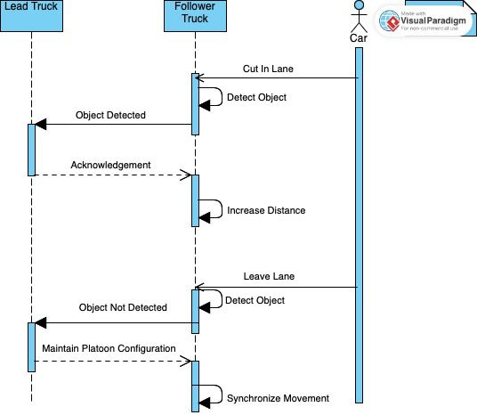

  
  
  

For this project, my team and I developed a truck platoon system aimed at improving autonomous vehicle coordination for modern logistics. The system used a distributed and parallel architecture, with a server-client model over TCP/IP to ensure reliable and efficient communication between the platoon vehicles, including leader trucks, follower trucks, and external vehicles such as cars. A key aspect of the project was enabling the platoon to dynamically adjust its formation when an external vehicle tried to pass between the trucks. This real-time platoon reconfiguration was managed through a robust communication protocol, which exchanged vital data regarding speed, distance, and formation changes.

I was specifically responsible for designing and implementing the communication protocols (V2X and V2P) to ensure effective message-passing between platoon members and external vehicles. Additionally, I contributed to the system’s architecture, which was designed using SysML and UML, allowing for clear representation and understanding of component interactions. We also employed GPU computation to handle logical matrices for optimized performance and quick decision-making in real time. For scheduling and task management, I worked on implementing the Rate Monotonic Scheduling (RMS) algorithm, ensuring that tasks were prioritized based on their frequency. Additionally, I contributed to the verification and validation of the system, with an initial focus on testing the serialization and deserialization of message objects.

We simulated the system using Tinkercad, which allowed us to observe and refine the platoon’s behavior in dynamic traffic scenarios. The system was developed in C++, ensuring computational efficiency to meet the real-time processing requirements. The results showed the system’s ability to adapt to the environment in real time and maintain platoon stability, making it a viable solution for autonomous fleet management.

You can learn more at the [Truck_Platoon](https://github.com/ESE-Semester-Project-Team-1/ESE-Group-1.git).
